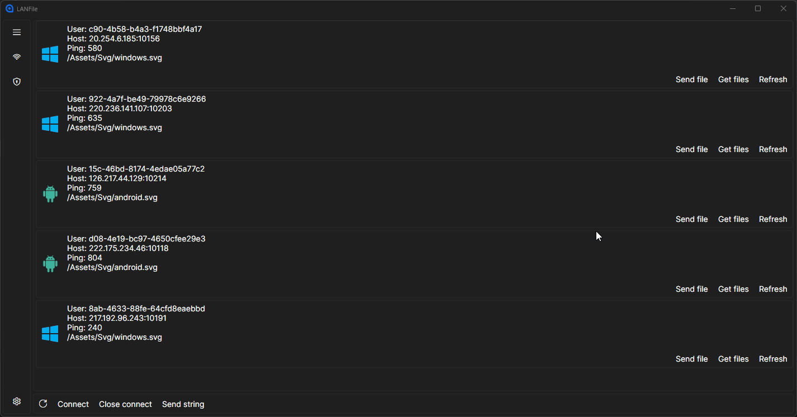

# В разработке.

## Using libs

```
SuperSimpleTcp - Для TCP подключений.
https://github.com/jchristn/supersimpletcp
BeaconLib - найти устройства в локальной сети.
https://github.com/rix0rrr/beacon
```


Приложения для обмена файлами. 
